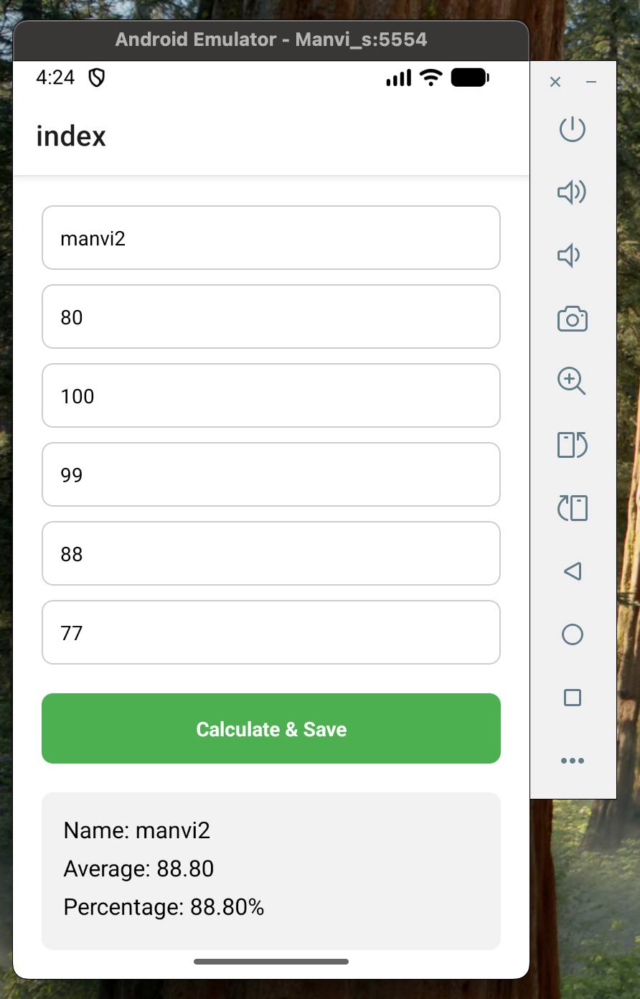
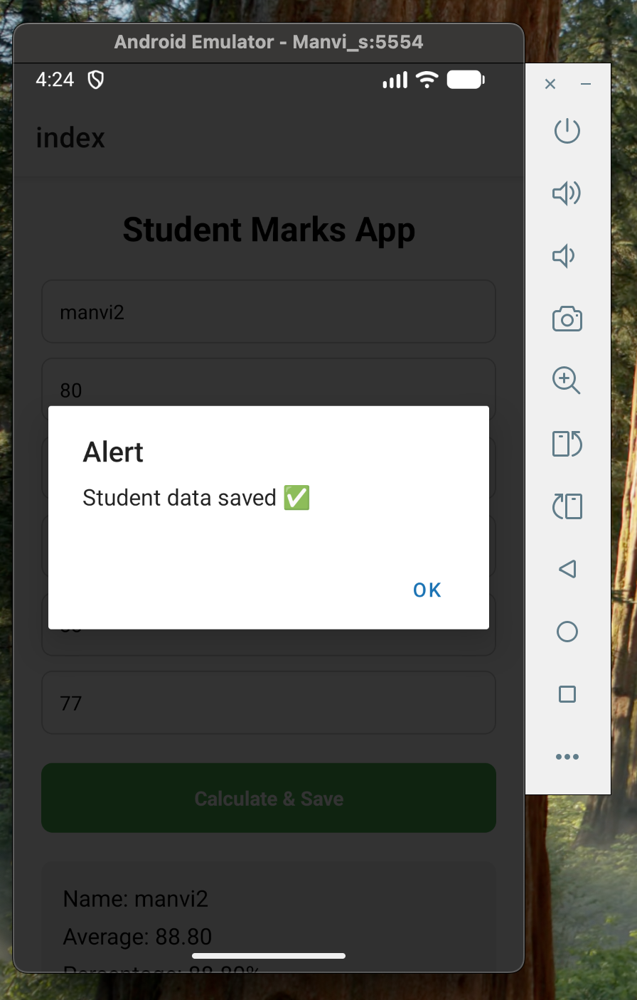
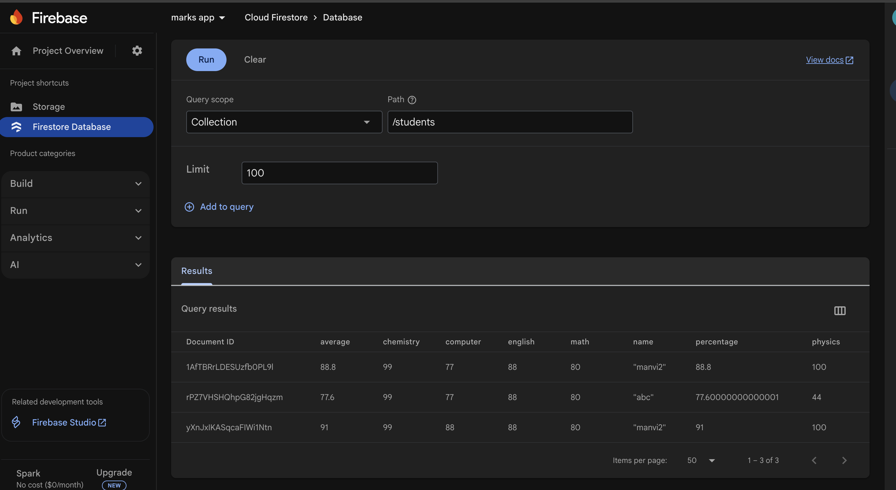

# 📊 Student Marks Calculator App

This is a simple mobile application developed using Expo React Native.  
The app allows teachers to enter student marks for five subjects, calculate the average and percentage, display the result on the screen, and store the data in Firebase Firestore.

This project is created as a college academic project to demonstrate basic React Native concepts and Firebase database integration.

---
## 📱 App Screenshots

  
  
  

  

 

## 🚀 Features
- Enter student name
- Enter marks for 5 subjects (Math, Physics, Chemistry, English, Computer)
- Automatically calculates average and percentage
- Displays output on the screen
- Stores student data in Firebase Firestore
- Scrollable user interface using ScrollView
- Simple and beginner-friendly design

---

## 🛠 Tech Stack
- Frontend: Expo React Native
- Database: Firebase Firestore
- Language: JavaScript
- Version Control: Git & GitHub

---

## 📂 Firestore Database Structure

students (collection)
 └── autoID (document)
     ├── name (string)
     ├── math (number)
     ├── physics (number)
     ├── chemistry (number)
     ├── english (number)
     ├── computer (number)
     ├── average (number)
     └── percentage (number)

Each student’s data is stored as a separate document in the students collection.

---

## 🔄 How the App Works
1. The user enters the student name and marks.
2. On clicking Calculate & Save:
   - Total marks are calculated
   - Average and percentage are calculated
   - The result is displayed on the screen
   - The data is saved to Firebase Firestore

---

## ▶️ How to Run the Project

npm install  
npx expo start

Open the app using Expo Go or an emulator.

---

## 🎯 Project Use Case
This application helps teachers to digitally store student marks, avoid manual calculations, and maintain academic records using a cloud database.

---

## 🧑‍🏫 Academic Note
Firebase Authentication is not used in this project as it is a demo academic project.  
Firestore is used in test mode for learning purposes.

---

## 👩‍💻 Author
Manvi Hans  
B.Sc. Physical Science with Computer Science  
Delhi University

---

## 🔗 GitHub
This project is version-controlled using Git and hosted on GitHub.
